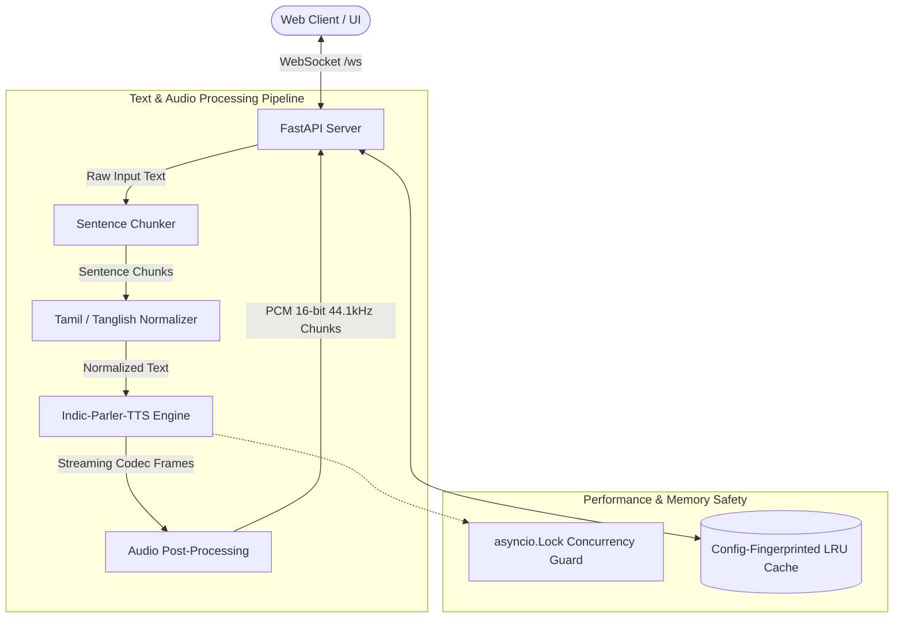

# Movio Tanglish TTS 🎙️

[](https://opensource.org/licenses/Apache-2.0)
[](https://www.python.org/)
[](https://fastapi.tiangolo.com/)
[](https://pytorch.org/)
[](https://huggingface.co/ai4bharat/indic-parler-tts)

**Movio Tanglish TTS** is a high-performance, real-time streaming Text-to-Speech (TTS) engine fine-tuned for **Tamil**, **English (Tamil accent)**, and **Tanglish** (code-mixed Tamil-English). Built atop AI4Bharat's **Indic-Parler-TTS** at **44.1 kHz**, it delivers expressive, natural human prosody with ultra-low Time-To-First-Audio (TTFA < 400ms) for conversational voice AI systems.

---

## 📑 Table of Contents

- [Overview](#overview)
- [Key Features](#key-features)
- [System Architecture](#system-architecture)
- [Directory Layout](#directory-layout)
- [Installation & Setup](#installation--setup)
- [Running the Server](#running-the-server)
- [WebSocket Protocol Reference](#websocket-protocol-reference)
- [Audio Processing Pipeline](#audio-processing-pipeline)
- [Configuration Reference](#configuration-reference)
- [Roadmap & Plan](#roadmap--plan)
- [License & Acknowledgements](#license--acknowledgements)

---

## 🌟 Overview

Standard TTS models often struggle with Indic code-switching, producing robotic inflections or mispronouncing bilingual colloquialisms common in conversational workflows (such as cab bookings, customer support, and deliveries).

Movio addresses this by combining:
1. **Indic-Parler-TTS (44.1 kHz)** for natural prosody and voice description steering.
2. **Sub-sentence sentence chunking** with progressive token streaming.
3. **Automated Tamil text normalization** (expanding numerals, currency symbols, and abbreviations into spoken Tamil phonemes).
4. **Broadcast-standard audio post-processing** (high-pass filtering, zero-crossing trimming, and LUFS loudness normalization).

---

## ✨ Key Features

- ⚡ **True Low-Latency Streaming:** Generates and streams raw PCM audio chunks over WebSockets incrementally as decoder tokens arrive. Time-to-first-audio (TTFA) drops to **~300ms–400ms**.
- 🗣️ **Native Tanglish & Code-Switching:** Seamlessly switches between Tamil script, Latin Tamil, and English loanwords without phoneme collapse or unnatural pauses.
- 🔢 **Intelligent Text Normalization:** 
  - Converts numbers and currencies (e.g., `₹1250` $\to$ `ஆயிரத்து இருநூற்று ஐம்பது ரூபாய்`).
  - Expands abbreviations, timestamps, and measurements automatically.
- 🎚️ **Broadcast-Grade Audio Mastering:**
  - 4th-order Butterworth High-Pass Filter (60 Hz cut-off) to remove DC bias and microphone rumble.
  - Silence gate with windowed fade envelopes to eliminate boundary clicks and pops.
  - Integrated ITU-R BS.1770-4 loudness normalization targeting **-16 LUFS (±1.0)** via `pyloudnorm`.
- 🛡️ **Production-Hardened:**
  - `asyncio.Lock` GPU concurrency guard preventing CUDA memory corruption under simultaneous requests.
  - Dynamic GPU hardware acceleration: automatic fallback between `bfloat16`, `float16`, and `float32`.
  - SHA-256 configuration-fingerprinted LRU cache preventing stale cache hits when voice prompts or sampling temperatures change.
- 💻 **Interactive Browser Studio:** Built-in web UI with live Web Audio API playback, real-time waveform visualizers, latency measurement (TTFA & sub-TTFA), and audio export (WAV).

---

## 🏗️ System Architecture



---

## 📁 Directory Layout

```
movio_new/
├── backend/
│   ├── __init__.py
│   ├── chunker.py           # Intelligent sentence boundary splitter
│   ├── config.py            # Global runtime parameters, dtypes, & voice prompts
│   ├── main.py              # Server bootstrap and model preloading
│   ├── normalizer.py        # Tamil text & numeral normalizer (indic-numtowords)
│   ├── server.py            # FastAPI app, static mounts, and WebSocket endpoint
│   └── tts_engine.py        # Threaded streaming Parler-TTS inference engine
├── frontend/
│   ├── index.html           # Real-time WebSocket audio visualizer & client
│   └── (static assets)
├── indic-parler-livestream.ipynb # Interactive experimentation & benchmarking notebook
├── kaggle_notebook.ipynb    # Kaggle GPU environment setup & tests
├── PLAN.md                  # Comprehensive architectural plan, SOTA analysis & benchmarks
├── requirements.txt         # Production Python dependencies
└── run.py                   # Application entry point
```

---

## 🚀 Installation & Setup

### Prerequisites
- **OS:** Linux or macOS (Apple Silicon supported via MPS / CPU; Linux NVIDIA GPU recommended for low latency)
- **Python:** 3.10 or newer
- **CUDA:** 11.8+ or 12.x (if running with NVIDIA GPU acceleration)

### 1. Clone the Repository
```bash
git clone https://github.com/sosush/Movio-Tanglish-TTS.git
cd Movio-Tanglish-TTS
```

### 2. Create and Activate a Virtual Environment
```bash
python3 -m venv .venv
source .venv/bin/activate  # On Windows: .venv\Scripts\activate
```

### 3. Install Dependencies
```bash
pip install --upgrade pip
pip install -r requirements.txt
```

> **Optional:** If you want additional Tamil resource normalization features, you can clone the Indic NLP resources repository:
> ```bash
> git clone https://github.com/anoopkunchukuttan/indic_nlp_resources.git
> export INDIC_RESOURCES_PATH=$(pwd)/indic_nlp_resources
> ```

---

## 🖥️ Running the Server

Start the application using the runner script:

```bash
python run.py
```

The server will:
1. Detect available compute devices (`cuda:0` vs `cpu`) and optimal precision (`bfloat16` / `float16` / `float32`).
2. Download and warm up `ai4bharat/indic-parler-tts`.
3. Start the Uvicorn ASGI server on `http://0.0.0.0:8000`.

### Accessing the Web Studio
Open your browser and navigate to:
```
http://localhost:8000
```
- Type or paste your Tamil, English, or Tanglish text.
- Click **Speak**.
- Experience real-time sub-chunk playback with live TTFA metrics and visual audio analyzers.

---

## 📡 WebSocket Protocol Reference

The streaming endpoint is available at `ws://localhost:8000/ws`.

### 1. Connection Handshake
Upon connection, the server sends configuration metadata:
```json
{
  "type": "config",
  "sample_rate": 44100
}
```

### 2. Synthesize Request (Client $\to$ Server)
```json
{
  "type": "synthesize",
  "text": "வணக்கம்! உங்கள் கேப் 5 நிமிடத்தில் வரும். Please be ready at the pickup location."
}
```

### 3. Streaming Events (Server $\to$ Client)

| Event / Message | Payload Type | Description |
| :--- | :--- | :--- |
| `chunks` | JSON | Emits raw sentences and normalized chunk list. |
| `chunk_start` | JSON | `{"type": "chunk_start", "index": 0, "text": "...", "cached": false}` |
| **Audio Data** | **Binary (bytes)** | Raw 16-bit PCM mono samples (`Int16`, 44.1 kHz). Sent continuously as chunks are generated. |
| `chunk_end` | JSON | `{"type": "chunk_end", "index": 0, "end_punct": "."}` — Includes punctuation hint for natural pause scheduling. |
| `done` | JSON | `{"type": "done"}` — Generation completed for the entire request. |

---

## 🎛️ Audio Processing Pipeline

Movio applies studio post-processing to ensure uniform listening levels across diverse speakers and environments:

1. **Anti-Rumble High-Pass Filter (HPF):**
   A 4th-order Butterworth filter ($f_c = 60\text{ Hz}$) eliminates sub-audible DC offset and low-frequency microphone rumble.
2. **De-Click & Windowed Fade:**
   Applies a 480-sample linear fade-out to prevent abrupt sample step-discontinuities that cause speaker pops.
3. **ITU-R BS.1770-4 LUFS Normalization:**
   Integrated loudness is computed via `pyloudnorm.Meter` and leveled to **-16.0 LUFS** (the standard for mobile voice assistants and podcasts).

---

## ⚙️ Configuration Reference

All settings can be customized in [`backend/config.py`](file:///Users/sohinibanerjee/movio_new/backend/config.py):

| Parameter | Default Value | Description |
| :--- | :--- | :--- |
| `DEVICE` | `cuda:0` / `cpu` | Target PyTorch device (auto-detected). |
| `TORCH_DTYPE` | `bfloat16` / `float16` | Model weights precision (optimized for GPU architecture). |
| `MODEL_ID` | `ai4bharat/indic-parler-tts` | Hugging Face model repository identifier. |
| `TEMPERATURE` | `1.0` | Sampling temperature for prosody richness and natural human cadence. |
| `VOICE_DESCRIPTION` | *"Jaya speaks with a slightly low-pitched voice..."* | Text conditioning prompt defining speaker persona, clarity, and pacing. |
| `CACHE_MAX_ENTRIES` | `200` | In-memory LRU cache capacity for synthesized sentences. |
| `PLAY_STEPS_IN_S` | `0.3` | Stream step interval (in seconds) for progressive chunk delivery. |
| `GENERATION_SEED` | `42` | Random seed for deterministic audio reproduction. |
| `PORT` | `8000` | Port for the FastAPI server (overridable via `PORT` environment variable). |

---

## 🗺️ Roadmap & Plan

For detailed engineering benchmarks, model evaluation notes, and upcoming phases (such as IndicF5 voice cloning and Romanized Latin Tamil transliteration), see the full specification in [PLAN.md](file:///Users/sohinibanerjee/movio_new/PLAN.md).

---

## 📜 License & Acknowledgements

- **License:** Distributed under the [Apache 2.0 License](https://opensource.org/licenses/Apache-2.0).
- **AI4Bharat:** For open-sourcing the remarkable [Indic-Parler-TTS](https://github.com/ai4bharat/indic-parler-tts) model.
- **Hugging Face:** For the [Parler-TTS](https://github.com/huggingface/parler-tts) streaming architecture.
